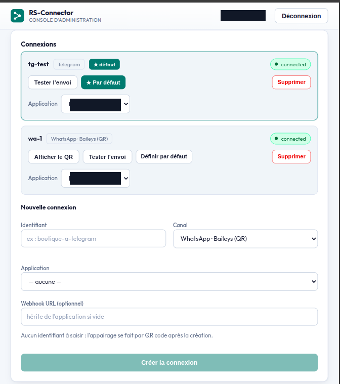
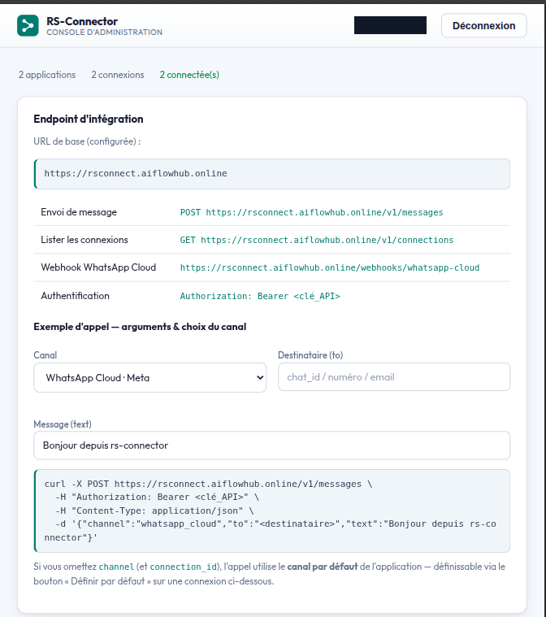
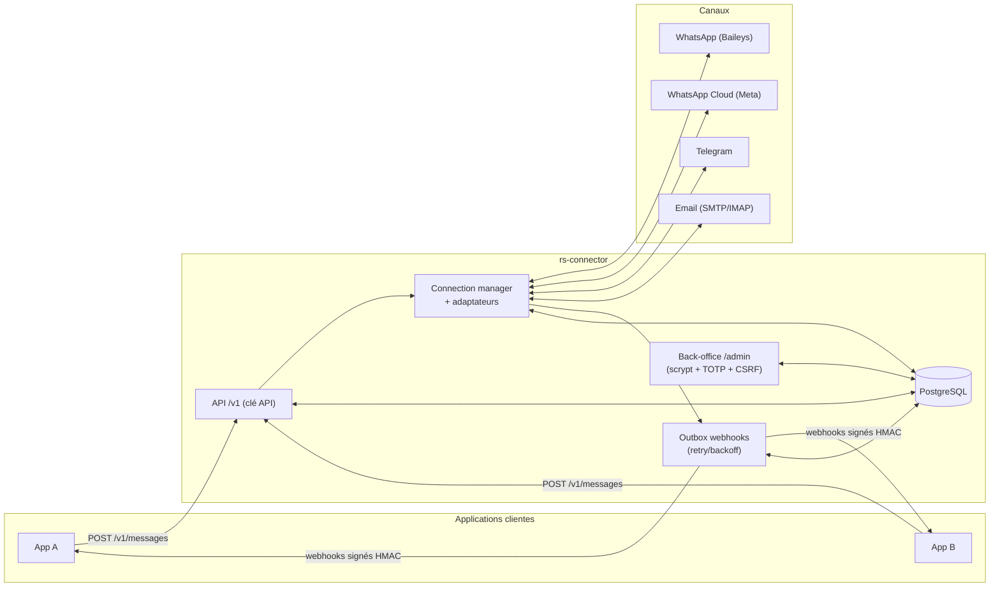

# rs-connector

**Hub de messagerie multi-canal, autonome, brancheable sur plusieurs applications via clé API et webhooks signés.**

[](./LICENSE)
[](https://nodejs.org)
[](#tests)
[](https://www.postgresql.org)

rs-connector se connecte à des canaux de messagerie (**WhatsApp**, **Telegram**, **Email**…),
**normalise** les messages entrants et sortants derrière une **interface HTTP unique**, et notifie
chaque application cliente via des **webhooks signés**. Un **back-office sécurisé** (mot de passe +
2FA TOTP) permet de gérer les comptes de canal et les applications branchées.

> **Service autonome.** Base de données, volumes et réseau dédiés. Il ne partage aucune ressource
> avec vos autres services : il s'y branche uniquement par HTTP (API d'entrée + webhooks sortants).
> Une application n'a jamais besoin de connaître Baileys, l'API Meta ou Telegram : elle parle à une
> seule API et reçoit des événements normalisés.

<p align="center">
  
  <br>
  <em>Back-office — gestion des connexions de canal : statut temps réel, canal par défaut, envoi de test.</em>
</p>

<p align="center">
  
  <br>
  <em>Panneau « Endpoint d'intégration » : URL de base, endpoints et exemple d'appel prêt à copier.</em>
</p>

---

## Sommaire

- [Fonctionnalités](#fonctionnalités)
- [Architecture](#architecture)
- [Démarrage rapide (Docker)](#démarrage-rapide-docker)
- [Développement local](#développement-local)
- [Configuration](#configuration)
- [Référence API](#référence-api)
- [Back-office](#back-office)
- [Sécurité](#sécurité)
- [Tests](#tests)
- [Structure du projet](#structure-du-projet)
- [Documentation](#documentation)
- [Feuille de route](#feuille-de-route)
- [Contribuer](#contribuer)
- [Licence](#licence)

## Fonctionnalités

- **4 canaux** derrière une abstraction d'adaptateur commune :

  | Canal | `channel_type` | Auth | Sens entrant |
  |---|---|---|---|
  | WhatsApp · Baileys (non officiel) | `whatsapp_baileys` | appairage par **QR** | socket temps réel |
  | WhatsApp Cloud API (Meta) | `whatsapp_cloud` | `token` + `phone_number_id` | webhook Meta |
  | Telegram | `telegram` | token de bot | long-polling |
  | Email | `email` | SMTP + IMAP | polling IMAP |

  > ℹ️ Le canal WhatsApp non officiel repose sur la bibliothèque **[Baileys](https://github.com/WhiskeySockets/Baileys)**
  > (`@whiskeysockets/baileys`), **non affiliée à WhatsApp/Meta** — à utiliser en connaissance des
  > conditions d'utilisation de WhatsApp. Pour un usage officiel, préférez le canal **WhatsApp Cloud API**.

- **Multi-application** — chaque application possède une **clé API** (stockée **hachée**, SHA-256)
  et reçoit ses **webhooks signés**. **Scoping strict** : une application ne voit et n'agit que sur
  ses propres connexions.
- **Interface d'envoi unique** — `POST /v1/messages` avec `{ channel, to, text }` ; rs-connector
  route vers la bonne connexion et le bon adaptateur.
- **Webhooks fiables** — outbox **persistante** avec retry/backoff exponentiel : un crash ou
  redémarrage ne perd jamais un événement.
- **Back-office sécurisé** — mot de passe **scrypt** + **OTP TOTP** (2FA), sessions httpOnly,
  protection **CSRF**, **rate-limit + lockout** du login.
- **Secrets chiffrés au repos** — credentials de canal en **AES-256-GCM** (clé injectée hors base,
  *fail-closed* : sans clé, la création de connexions avec secrets est refusée).
- **Robustesse** — restauration des connexions au démarrage, machine à états des statuts de message,
  résolution de contacts (LID → numéro) mise en cache.

## Architecture



- **Sens sortant** : l'application appelle `/v1` (authentifiée par clé API) → adaptateur du canal.
- **Sens entrant** : le canal émet un message → rs-connector le normalise → **outbox** → webhook
  signé HMAC vers l'application.

## Démarrage rapide (Docker)

```bash
cp .env.example .env

# 1) Générer la clé de chiffrement des credentials
node scripts/generate-key.js          # → à coller dans CREDENTIALS_ENCRYPTION_KEY
# Éditez .env : DB_PASSWORD, WEBHOOK_SECRET, CREDENTIALS_ENCRYPTION_KEY, WHATSAPP_CLOUD_* …

# 2) Réseau externe pour les applications clientes (une seule fois)
docker network create rs-connector-apps

# 3) Démarrer
docker compose up -d --build

# 4) Créer le premier compte admin du back-office
docker compose exec rs-connector node scripts/create-admin.js <identifiant> '<mot-de-passe-fort>'
```

Le service écoute sur `127.0.0.1:3007` — santé : `GET /health`.

## Développement local

```bash
# Backend (API + adaptateurs)
npm install
npm test                              # 229 tests, sans réseau réel (dépendances mockées)
DB_HOST=localhost DB_PASSWORD=… \
  CREDENTIALS_ENCRYPTION_KEY=$(node scripts/generate-key.js) \
  ADMIN_COOKIE_SECURE=false npm start

# Back-office (dans un autre terminal)
cd frontend
npm install
npm run dev                           # http://localhost:5173 (proxy /admin → :3007)
```

- **Node.js ≥ 20** (testé sous Node 22), **PostgreSQL 16** (fourni par `docker-compose`).
- Le front (`frontend/`, Vite + React) est une application séparée servie statiquement en prod.

## Configuration

Toute la configuration passe par des **variables d'environnement** (voir [`.env.example`](./.env.example)).

| Variable | Défaut | Rôle |
|---|---|---|
| `PORT` | `3007` | Port HTTP interne du service. |
| `LOG_LEVEL` | `info` | Niveau de log pino (`trace`…`fatal`). |
| `AUTH_DIR` | `/data/auth` | Répertoire des données d'auth de canal (ex. sessions Baileys). |
| `DB_HOST` / `DB_PORT` | `localhost` / `5432` | Connexion PostgreSQL. |
| `DB_NAME` / `DB_USER` / `DB_PASSWORD` | `rs_connector` / `rs_connector` / — | Base dédiée. |
| `CREDENTIALS_ENCRYPTION_KEY` | — | **Clé AES-256-GCM** (32 octets base64) des credentials au repos. Vide ⇒ *fail-closed*. |
| `WEBHOOK_SECRET` | — | Secret HMAC **de repli** pour signer les webhooks (chaque app peut avoir le sien). |
| `DEFAULT_WEBHOOK_URL` | — | URL webhook de repli si une connexion/app n'en configure pas. |
| `PUBLIC_BASE_URL` | — | URL publique du service, affichée aux apps. **À définir en prod** (derrière un proxy). |
| `V1_RATE_LIMIT_PER_MIN` | `240` | Anti-abus : requêtes `/v1/messages` par application et par minute (`0` = désactivé). |
| `WHATSAPP_CLOUD_VERIFY_TOKEN` | — | Vérification du webhook Meta (GET). |
| `WHATSAPP_CLOUD_APP_SECRET` | — | Vérification HMAC `X-Hub-Signature-256` des POST Meta. |
| `WHATSAPP_CLOUD_GRAPH_VERSION` | `v21.0` | Version de l'API Graph. |
| `ADMIN_TOTP_ISSUER` | `rs-connector` | Libellé dans l'app d'authentification TOTP. |
| `ADMIN_SESSION_TTL` | `43200` | Durée de vie d'une session admin (secondes). |
| `ADMIN_COOKIE_SECURE` | `true` | Flag `Secure` du cookie (mettre `false` en dev HTTP local). |

Détails complets : [`docs/CONFIGURATION.md`](./docs/CONFIGURATION.md).

## Référence API

### API application (`/v1`, authentifiée par clé API)

En-tête requis : `Authorization: Bearer <clé_API>`.

| Méthode | Chemin | Description |
|---|---|---|
| `POST` | `/v1/messages` | Envoi sortant `{ channel, to, text }` (`connection_id` optionnel pour lever une ambiguïté). |
| `GET` | `/v1/connections` | Liste des connexions de l'application (avec `defaultConnectionId` / `isDefault`). |
| `GET` | `/v1/connections/:id` | Détail d'une connexion (scoping strict à l'application). |

```bash
curl -X POST https://rs-connector.example.com/v1/messages \
  -H "Authorization: Bearer dk_votreCleAPI" \
  -H "Content-Type: application/json" \
  -d '{ "channel": "telegram", "to": "<destinataire>", "text": "Bonjour !" }'
```

### Webhooks sortants (rs-connector → votre application)

`POST` vers l'URL configurée, en-têtes `X-Webhook-Event` + `X-Webhook-Signature: sha256=<hex>`
(HMAC-SHA256 du corps brut). Événements : `message.received`, `message.status_changed`,
`session.connected`, `session.disconnected`. Guide complet et exemple de vérification :
[`docs/INTEGRATION.md`](./docs/INTEGRATION.md).

### Webhook WhatsApp Cloud (Meta → rs-connector)

`GET/POST /webhooks/whatsapp-cloud` — validation du `hub.challenge` puis vérification de la
signature `X-Hub-Signature-256`.

### Back-office (`/admin`, session + OTP + CSRF)

`login`, `login/otp`, `logout`, `me`, `change-password`, `totp/setup`, `totp/enable` ; provisioning
des `applications` (+ `:id/regenerate-key`, `:id/rotate-webhook-secret`) et des `connections`
(+ `:id/qr`, `:id/send`, `:id/webhook`).

### Santé

`GET /health` → `200` si le service est prêt.

## Back-office

Le front (`frontend/`, Vite + React) offre le parcours **login → OTP (si activé) → dashboard**.
Depuis le dashboard on peut :

- créer des **applications** (la clé API est affichée **une seule fois**, puis seulement régénérable) ;
- créer des **connexions** de canal (canal, application propriétaire, credentials, appairage QR) ;
- activer la **2FA (TOTP)** sur son compte admin ;
- consulter l'**endpoint d'intégration** (URL de base + endpoints détectés).

En production, servez le `dist/` du front derrière le **même domaine** que l'API (cookie de session
`SameSite=Strict` + `Secure`).

## Sécurité

- **Clés API & tokens de session** stockés **hachés** (SHA-256) — jamais en clair.
- **Mot de passe admin** haché **scrypt** ; **OTP TOTP** (RFC 6238) ; secret TOTP chiffré au repos.
- **Credentials de canal** chiffrés **AES-256-GCM** (clé hors base ; *fail-closed* sans clé).
- **Webhooks entrants Meta** vérifiés par **HMAC** (`X-Hub-Signature-256`).
- **CSRF** (jeton synchroniseur) sur toutes les mutations du back-office ; **rate-limit + lockout** du login.
- **Anti-abus** : quota par application sur `/v1/messages` (`V1_RATE_LIMIT_PER_MIN`).
- `npm audit` : **0 vulnérabilité** côté backend (dépendances de production).

> ⚠️ **Ne committez jamais** votre `.env`, le dossier `.data/` (clé de chiffrement, auth WhatsApp,
> cookies) ni la base : ils sont déjà exclus par `.gitignore`.

## Tests

```bash
npm test        # 229 tests (node:test) — dépendances réseau mockées, aucun appel réel
```

## Structure du projet

```
src/
  adapters/         # whatsapp-baileys, whatsapp-cloud, telegram, email (+ registre index.js)
  admin/            # password (scrypt), totp, auth-admin (sessions/CSRF), routes (/admin)
  connection-manager.js         # gestion générique des connexions par channel_type
  crypto-vault.js   # AES-256-GCM (credentials au repos)
  db.js  schema.sql # PostgreSQL dédié
  app.js  index.js  # Express + démarrage
scripts/            # create-admin.js, generate-key.js
frontend/           # back-office Vite + React (application séparée)
django/             # control-plane Django alternatif (secondaire, optionnel)
docs/               # INTEGRATION.md, CONFIGURATION.md
test/               # 229 tests (node:test)
```

## Documentation

- [`docs/INTEGRATION.md`](./docs/INTEGRATION.md) — brancher une application (clé API, connexions,
  envoi, réception & vérification des webhooks, codes d'erreur).
- [`docs/CONFIGURATION.md`](./docs/CONFIGURATION.md) — référence complète des variables d'environnement
  et conseils de déploiement.
- [`PLAN-TACHES.md`](./PLAN-TACHES.md) — architecture détaillée, choix techniques et points ouverts.

## Feuille de route

Voir la section « Points ouverts » de [`PLAN-TACHES.md`](./PLAN-TACHES.md) : connexions partageables
entre applications, secret webhook par application dans l'outbox, canaux additionnels
(Discord / SMS / Teams), support des médias.

## Contribuer

Les contributions sont bienvenues ! Ouvrez une *issue* pour discuter d'un changement important,
puis une *pull request*. Merci de garder les **tests verts** (`npm test`) et de **ne jamais**
committer de secret (`.env`, `.data/`, credentials).

## Remerciements

Le canal WhatsApp non officiel est propulsé par **[Baileys](https://github.com/WhiskeySockets/Baileys)**
(`@whiskeysockets/baileys`). Merci également aux projets [Express](https://expressjs.com),
[pino](https://getpino.io), [node-postgres](https://node-postgres.com), [Vite](https://vitejs.dev)
et [React](https://react.dev).

## Licence

[MIT](./LICENSE) © 2026 mrnsmh
